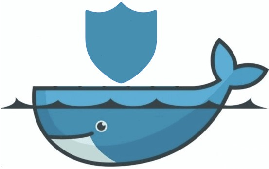
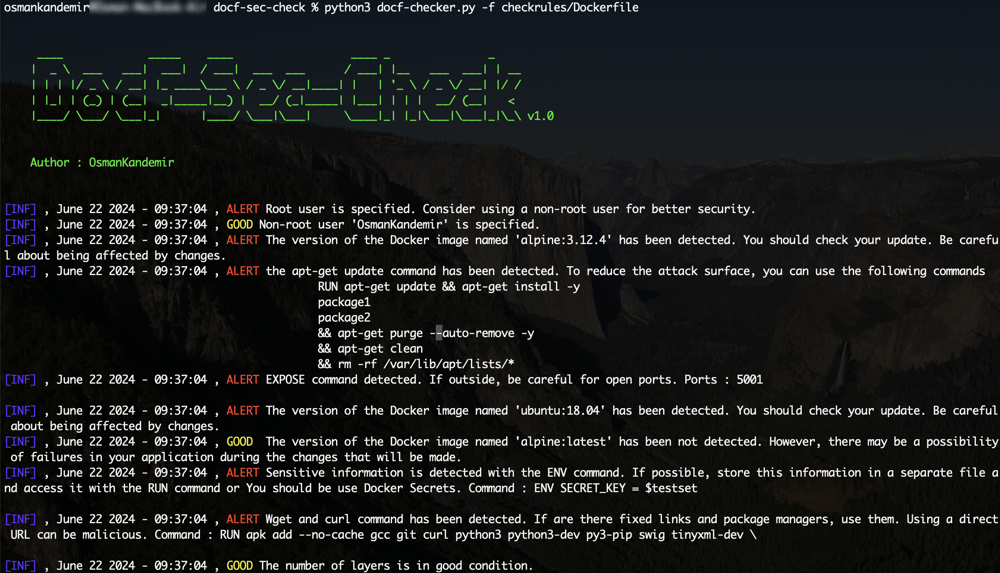

[](https://www.github.com/OsmanKandemir/docf-sec-check)
[](https://github.com/OsmanKandemir/docf-sec-check)
[](https://www.python.org)
[](https://github.com/OsmanKandemir/docf-sec-check/blob/main/LICENSE)
[](https://www.docker.com)
[](https://www.python.org)

# DocF-Sec-Check

## Description

DockF-Sec-Check helps to make you Dockerfile commands more secure.


## ScreenShot



## Done

- [x] First level security notification in Dockerfile.

## TODO List
- [ ] Detecting the Dockerfile correctly.
- [ ] Two level security notification in Dockerfile.
- [ ] Security noticification in Docker images.
- [ ] *********** (Private Repository)

## Installation

### From Source Code

You can use virtualenv for package dependencies before installation.

```
git clone https://github.com/OsmanKandemir/docf-sec-check.git
cd docf-sec-check
python setup.py build
python setup.py install
```

### From Pypi

The script is [available on PyPI](https://pypi.org/project/docfseccheck/). To install with pip:
```
pip install docfseccheck
```

### From Dockerfile

You can run this application on a container after build a Dockerfile. You need to specify a path (YOUR-LOCAL-PATH) to scan the Dockerfile in your local.

```
docker build -t docfseccheck .
docker run -v <YOUR-LOCAL-PATH>/Dockerfile:/docf-sec-check/Dockerfile docfseccheck -f /docf-sec-check/Dockerfile

```

### From DockerHub

```
docker pull osmankandemir/docfseccheck:v1.0
docker run -v <YOUR-LOCAL-PATH>/Dockerfile:/docf-sec-check/Dockerfile osmankandemir/docfseccheck:v1.0 -f /docf-sec-check/Dockerfile


```

## Usage


```
-f DOCKERFILE [DOCKERFILE], --file DOCKERFILE [DOCKERFILE] Dockerfile path. --file Dockerfile
 
```

#### Function Usage

```
from docfchecker import DocFChecker

#Dockerfile is your file PATH.

DocFChecker(["Dockerfile"]) 

```


## Development and Contribution

#### See; [CONTRIBUTING.md](CONTRIBUTING.md)


## License

Copyright (c) 2024 Osman Kandemir \
Licensed under the GPL-3.0 License.

## Donations

If you like DocF-Sec-Check and would like to show support, you can use **Buy A Coffee** or **Github Sponsors** feature for the developer using the button below.

Or

Sponsor me : https://github.com/sponsors/OsmanKandemir 😊

<a href="https://www.buymeacoffee.com/OsmanKandemir" target="_blank"></a>

Your support will be much appreciated😊


